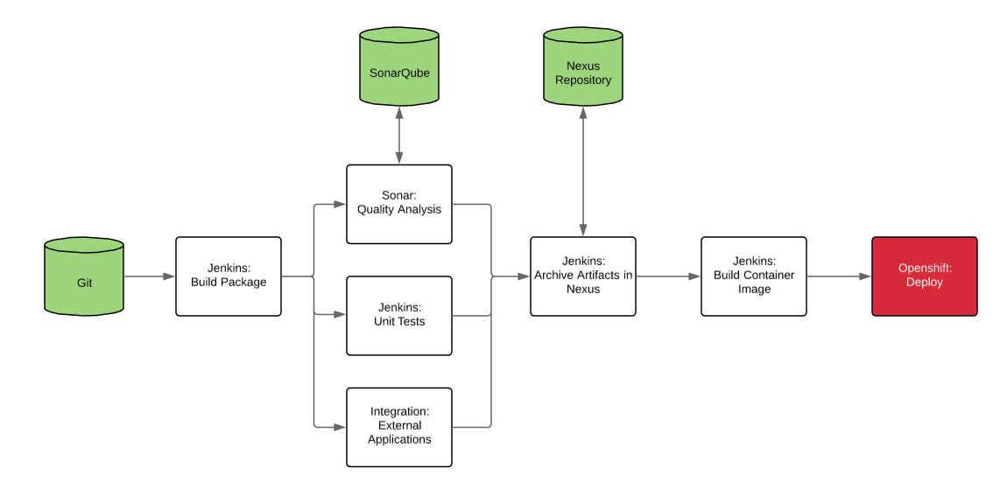

# Github - Jenkins - Openshift Repo/Lab

This repo creates Openshift objects on-the-fly correlating to that branch.

In this lab you will need a few things to get started.
1. Access to Internet
2. Github Account
3. Access to an Openshift Cluster

Flow of the lab:
1. Create an Openshift Project
2. Add Jenkins-Ephemeral application to the Openshift Project (using the Openshift Catalog).
2. Create the Jenkins Multi-Branch Pipeline in Jenkins to hold 

In this lab we used the Multi-Branch pipeline in Jenkins. This allows us to grab the branch name from the Jenkins environment variable (branch_name).
